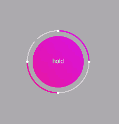

# WHBreathView

### 仿calm呼吸view

###### 使用方式：

```
    WHBreathView *breathView = [[WHBreathView alloc]initWithFrame:CGRectMake(20, 100, 300, 300)];
    breathView.breathType = FourPoint;
    [self.view addSubview:breathView];
    [breathView startBreath];
```
###### 效果：

